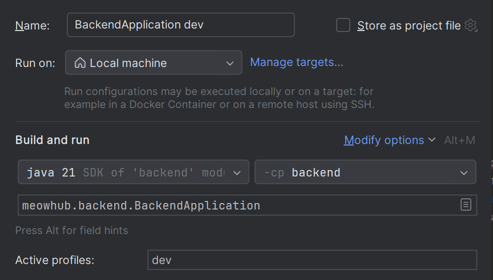
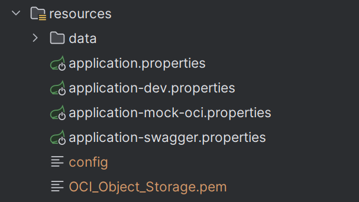

# MeowHub
Engineering Thesis

## Database
For production environment, you need to have an oracle database.
If you didn't create oracle database yet, run script `database/install.sql`.
(run the application to instantiate mock users via SecurityConfig)

## Profiles
`swagger` - to run application with Swagger  
`dev`     - to run application with H2 database (for offline development)
`mock-oci`- to run application with mock  connection to oci object storage (for offline development)

## Swagger
To run swagger use `swagger` profile.  
Link to swagger documentation: http://localhost:8080/swagger-ui/index.html

## Offline development && Testing
To develop application offline please use `dev` profile - it uses h2 database instead of oracle database that is used on production.  
  
No other configurations are needed.

## Offline development with mock OCI
To develop application offline with mock connection to OCI object storage please use `mock-oci` profile.
With this profile, you can test file upload/download without connecting to OCI object storage - the method will return a mock url and save it to database.
Of course, it will not save the file to OCI object storage and the mock url will not work on frontend side.

## Environment variables
`DB_URL` - database url    
`DB_USERNAME` - database username  
`DB_PASSWORD` - database password  
`JWT_SECRET` - secret key for JWT token    
`JWT_EXPIRATION_MS` - expiration time for JWT token in milliseconds  

With production environment, you need to set all of these variables.

## OCI object storage connection
To connect to OCI object storage you need to add `config` and `private-key` files to `resources` directory.  
  
On creation of the API key in Oracle Cloud User Settings, you will get contents of the `config` and generate a `private-key`.  
Of course, you need to have an account in Oracle Cloud and have created a bucket for object storage there first.  